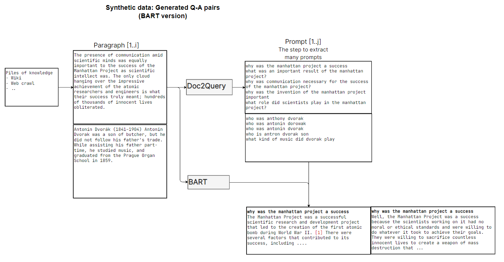
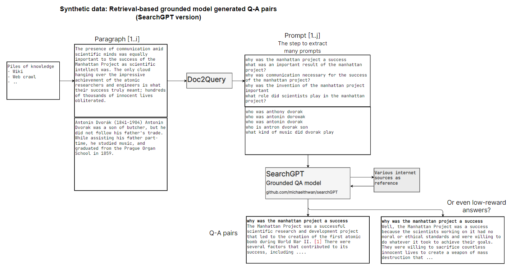

# Dataset: Retrieval-based grounded model generated Q-A pairs #2004

Related to [Issue #2004](https://github.com/LAION-AI/Open-Assistant/issues/2004)

# How it work?

1. Base data: [hugging face: wikipedia](https://huggingface.co/datasets/wikipedia)
2. Cleanse data to shorten the length of the articles
3. Generate Q-A pairs using doc2query
4. Generate Q-A pairs using BART or SearchGPT

### Syntheic data based on BART

### Syntheic data based on SearchGPT

# Code

1. `pip install -r requirements.txt` (using python 3.10.8)
2. Clean data: `1_clean_wikitext.py`
3. Get queries by doc2query `2_wikitext_doc2query.ipynb` (I run using colab+local PC)
4. Get responses by BART `3_10k_bart_trial.py` or `3_10k_bart_trial.ipynb`