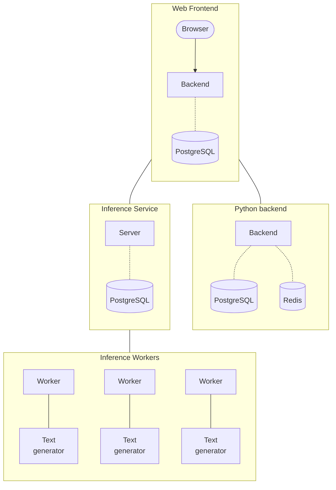

I thought it would make sense to document our architecture as a blog post, since
it would be easily visible for everyone, and it would also be nice to look back
a couple months from now and see how stuff has changed :)

A lot of work was done in the past couple of week to establish the needed
infrastructure both for data collection and inference purposes. Thanks to
everyone, and especially community members who supported us so far!

Our current plan for the architecture of the Open Assistant is as follows:

We are working on setting up the inference as shown above, and considering our
options for hosting, also, we want to move our authentication from the website
to the python backend.

Of course, this is by no means final, and lot of questions are still open, and
that is the fun of it! If you want to join us on our journey, just give our
[github](https://github.com/LAION-AI/Open-Assistant) a look!
