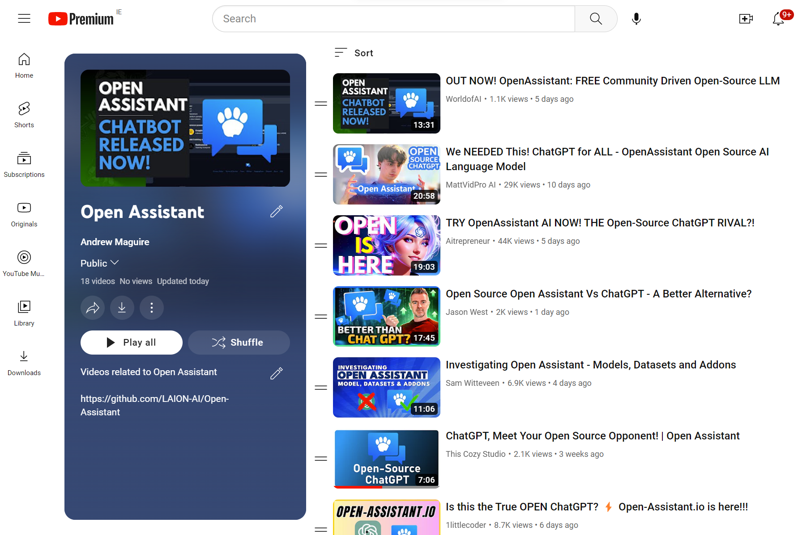

import ReactPlayer from "react-player";

Following the release of the OpenAssistant dataset, models and chat
capabilities, YouTube has been on fire (almost as much as our servers) with
OpenAssistant videos.

Below are some to check out.

If you want more, here is a
[playlist](https://youtube.com/playlist?list=PL6Zhl9mK2r0L9h90uBaIKrHBQQEEPrsxq)
of all the recent videos we could find.

<!--truncate-->

<ReactPlayer
  controls
  width="100%"
  url="https://www.youtube.com/embed/TFa539R09EQ"
/>   <ReactPlayer
  controls
  width="100%"
  url="https://www.youtube.com/embed/FQIHLFLrTw0"
/>   <ReactPlayer
  controls
  width="100%"
  url="https://www.youtube.com/embed/CEt2nRzUVpE"
/>   <ReactPlayer
  controls
  width="100%"
  url="https://www.youtube.com/embed/VFPrwxPBBVU"
/>   <ReactPlayer
  controls
  width="100%"
  url="https://www.youtube.com/embed/X3Oe8uYNITM"
/>   <ReactPlayer
  controls
  width="100%"
  url="https://www.youtube.com/embed/bZj7wGWmNow"
/>
