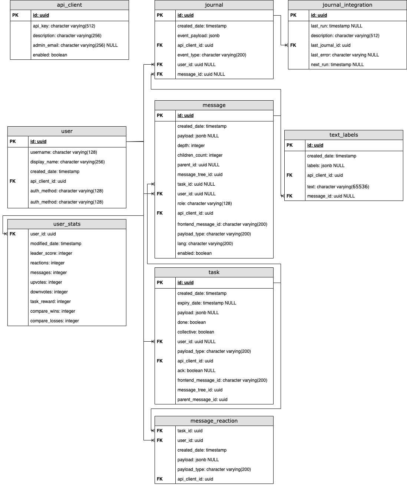
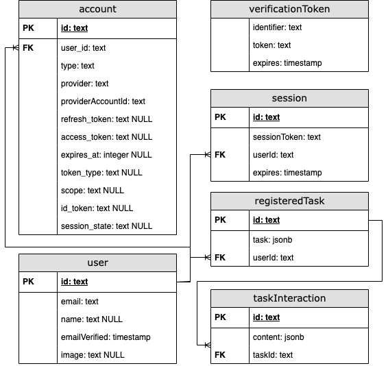

# OpenAssistant Data Schemas

## Introduction

This document describes the data schemas used by OpenAssistant. The schemas are
defined as Python classes, but can be implemented in any format, be that Python,
JSON, XML, SQL, Parquet files, etc.

Also, the schemas are leaning heavily on the
[OpenAssistant Data Structures](https://docs.google.com/presentation/d/1iaX_nxasVWlvPiSNs0cllR9L_1neZq0RJxd6MFEalUY/edit?usp=sharing)
presentation.

_Note on conformity: be pragmatic and decide what makes sense 🙂 , it's more
important that we move forward than cramming everything into a uniform thing._

## Data Schemas

### Main structure: conversation trees

Conversation trees are the fundamental data structure. Many of the datasets we
want to collect can be represented as conversation trees, such as QA datasets,
chat logs, reddit dumps, etc. The main idea is that a conversation tree starts
with a prompt and branches out from there. Every node can also have metadata,
such as collected rankings, labels, or other information.

Datasets that just represent linear data, such as a list of questions and
answers, can be represented as a conversation tree with just a single branch.

```python
class ConversationTreeNode:
    text: str # The text of the node
    role: Literal['prompter', 'assistant'] # Whether the node is a user prompt/follow-up or an assistant response
    children: list[ConversationTreeNode] # The children of the node (if you have a linear conversation, this will be of length 0 or 1)
    metadata: dict[str, Any] # Node metadata (see below)

class ConversationTree:
    root: ConversationTreeNode # The node containing the initial prompt
    metadata: dict[str, Any] # Tree metadata, different from root node metadata.

```

### Metadata

Metadata encapsulates all the information that is not part of the conversation
itself. This includes data about how the node was created (i.e. where it is
from: crowd-sourced, templated, scraped, etc.), when it was created, its labels,
tags, collected rankings, and other information.

## Example: Reddit AMA dataset

- Represent each question-follow-up set as a conversation tree.
- Store things like usernames, timestamps, upvotes, etc. as metadata of the
  nodes.
- Store things like the AMA title, the AMA author, the AMA subreddit, etc. as
  metadata of the tree.

## Example: QA dataset

- Represent each question-answer pair as a conversation tree.
  - The question is the prompt, the answer is the assistant response.
- If the dataset contains multiple answers to each question, each answer can be
  a child of the question node.
- If the dataset contains context text, it can be added as metadata to the
  question node.

## Example: Templated math problem dataset

- Represent each problem as a conversation tree with the problem text as the
  prompt and the solution as the assistant response.
- Store the problem type (e.g. algebra, geometry, etc.) as metadata of the tree.
- Store the template used also as metadata of the tree, as well as the source of
  the data used to fill the template.

## File Formats

The above data should be representable in most file formats, but some care has
to be taken with respect to the recursive nature of the data.

Most row-major formats (JSON, Avro, Protobuf, etc.), as well as many databases,
have no trouble with recursive (or arbitrary) schemas, but column-major formats,
such as Parquet, do. For datasets with linear conversations, like many of the
datasets we are collecting, this is not a problem. Instead of a tree of nodes,
simply represent the conversation as a list of nodes. For true tree-like
conversations, we should use a row-major format.

## Other considerations

- For text data of moderate size, it really doesn't matter much. It's more
  important to use consistent data structures and naming, than to worry about
  the exact file format.
- For crowd-sourced data, we are collecting it into a SQL database already.
- Parquet files are a good choice for large datasets, modulo the issues with
  recursive schemas.
- If parquet can't be used, gzipped JSON-line files are a good choice. So are
  Avro files and protobufs. Keep in mind that column-major files are better for
  reading, filtering, and aggregating, but row-major files are better for
  writing.

# Task-Specific Data Schemas

The main tasks are a) generation of response text and b) ranking of responses.
The following sections describe the data schemas for each of these tasks. Both
should be implementable in parquet files.

Note: These files are meant to be consumed by ML algorithms and should ideally
be produced from the above files.

## Common Data Structures

```python

class Message:
  text: str # The text of the message
  role: Literal['prompter', 'assistant'] # Whether the message is a user prompt/follow-up or an assistant response

class Thread:
  messages: list[Message] # The messages in the conversation

```

The corresponding parquet schemas are:

```parquet
message Message {
  required binary text (UTF8);
  required binary role (UTF8);
}

message Thread {
  required group messages (LIST) {
    repeated group list {
      required group element {
        required binary text (UTF8);
        required binary role (UTF8);
      }
    }
  }
}

```

## Generation

```python

class GenerationExample:
  thread: Thread # The conversation thread before the message to be generated
  message: Message # The message to be generated

```

The corresponding parquet schema is:

```parquet
message GenerationExample {
  required group thread (LIST) {
    repeated group list {
      required group element {
        required binary text (UTF8);
        required binary role (UTF8);
      }
    }
  }
  required group message (LIST) {
    repeated group list {
      required group element {
        required binary text (UTF8);
        required binary role (UTF8);
      }
    }
  }
}

```

## Ranking

```python

class RankingExample:
  thread: Thread # The conversation thread before the message to be ranked
  messages: list[Message] # The messages to be ranked, in oder of decreasing preference

```

The corresponding parquet schema is:

```parquet
message RankingExample {
  required group thread (LIST) {
    repeated group list {
      required group element {
        required binary text (UTF8);
        required binary role (UTF8);
      }
    }
  }
  required group messages (LIST) {
    repeated group list {
      required group element {
        required binary text (UTF8);
        required binary role (UTF8);
      }
    }
  }
}

```

## Databases

Open-Assistant uses two databases, one for the backend and one for the frontend.
Both are [PostgreSQL](https://www.postgresql.org/) databases which run in docker
containers.

### Backend ER-Diagram



**Notes**

- In order for the diagram to not be too messy, foreign key connection to
  `api_client` are not shown
- `frontend_message_id` references `id` of `taskInteraction` on the frontend

  ### Frontend ER-Diagram

  

  **Notes**

- `id` of `registeredTask` references `id`of `message`on the backend
