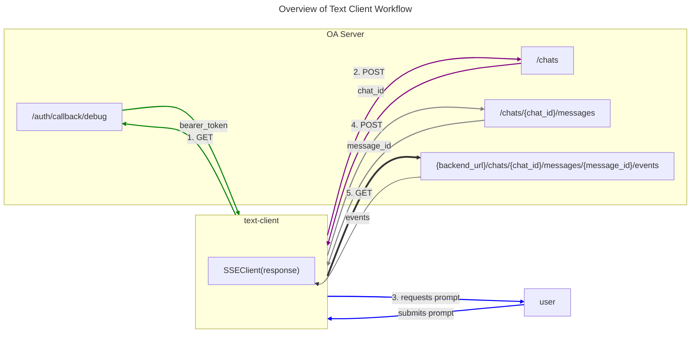

# Inference

### From the perspective of the Text Client

For development, a basic REPL client is used as a chat interface, built around
[Typer](https://typer.tiangolo.com/). The bulk of the logic is in
`inference.text-client.text_client_utils.DebugClient`. The basic steps are as
follows:

1. The debug client first authenticates with a GET request to
   `/auth/callback/debug` which returns a bearer token, which is then set in
   future request headers.

2. After authenticating, the `DebugClient` creates a "chat" by posting to
   `/chats`, which returns a `chat_id` for session.

3. The script then collects the user prompt.

4. The `DebugClient` posts to the endpoint `/chats/{chat_id}/messages`. Included
   in this request is the message content, a `parent_id:str` (ID of assistant's
   response to prior message, if there is one), the `model_config_name:str`, and
   inference `sampling_parameters:dict`. In the response, the server will return
   a `message_id:str`.

5. The client will use this id to make a GET request to
   `{backend_url}/chats/{chat_id}/messages/{message_id}/events`. Critically, in
   this `get()` method of requests, the `stream=True` is passed, meaning that
   the response content will not be immediately downloaded but rather streamed.
   Additionally, the actual GET request must have
   `"Accept": "text/event-stream"` in the headers to let the server know we are
   awaiting an event stream.

6. The response is then used to instantiate an SSEClient, which - via its
   events() method, returns an iterable that can be used to print out inference
   results, one token at a time.

7. After exhausting the events iterable (ie inference is complete), the user is
   prompted for a new message.

### From the perspective of the OA Inference Server

The inference server is built around [FastAPI](https://fastapi.tiangolo.com/).

1. When the client posts to `/chats`, the UserChatRepository - an interface
   between application logic and chats message tables - creates a chat in the
   chat table, which assigns the needed chat id and is returned in the response
   to the client.

2. Next, the client POSTs to `/chats/{chat_id}/prompter_message`, which uses the
   `UserChatRepository` to:

   1. Check to see if the message content included in the POST request is longer
      than the configured settings.
   2. Using the database session and `user_id` which was configured when this
      instance of `UserChatRepository` was instantiated, we lookup in the `chat`
      table the corresponding entry for this `chat_id` and `user_id`.
   3. Check to see if the total number of assistant + prompter messages in the
      `chat` is greater than the configured settings.
   4. If this is a new chat (i.e. no `parent_id` is set in the `chat`), and the
      chat table contains no title for chat of that id, updates the chat table
      with the initial user prompt as title.
   5. Creates a message in the message table for the user prompt.

3. The client then POSTs to `/chats/{chat_id}/assistant_message`.

   1. First we load the model config for the `model_config_name` specified by
      the client's request.
   2. Then, we use the `UserChatRepository` to post to create a message in the
      `message` table, with a pending state. Note, we also will update the state
      for any other currently pending messages in the chat to
      `inference.MessageState.cancelled`.
   3. After updating the `message` table, we create a RedisQueue for this
      specific message and enque the message.
   4. Finally, we return an `inference.MessageRead` (a Pydantic model) to the
      client. This is the object contains the needed `message_id`.

4. Once the client has the `message_id`, it will make a GET request to
   `/chats/{chat_id}/messages/{message_id}/events`. Upon receiving this request,
   the server retrieves the message from the message table and verifies that the
   message isn't finished and that the message role is assistant.

After this, we get the Redis queue for this specific message id. From here, we
poll the queue, using the `dequeue()` method. By default this method will block
for up to 1 second, however if a message is added to the queue in that interval,
it will automatically be returned. Otherwise, `dequeue()` will return `None`.

If `None` is returned and this is the first time we have polled the queue since
its creation, we will yield a `chat_schema.PendingResponseEvent`. The loop will
continue, with 1 second blocking (by default), until a message item is returned.
A message item is a tuple where the first element is a string of the message id,
and the second element is a response. After some checks on the message response
type (for example if there is a safety intervention or an internal error from
the worker), we yield a `chat_schema.MessageResponseEvent`. The message polling
and yielding is bundled in an `EventSourceResponse` object.

The EventSourceResponse is Server Sent Events (SSE) plugin for
Starlette/FastAPI, which takes content and returns it as part of a HTTP event
stream. You can check out the EventSourceResposethe library's
[source code](https://github.com/sysid/sse-starlette/tree/master) for more
details about how this works.

### From the perspective of the OA Worker

**This section is not yet written**. If you are interested in helping write it
please get in touch on GitHub or Discord.
