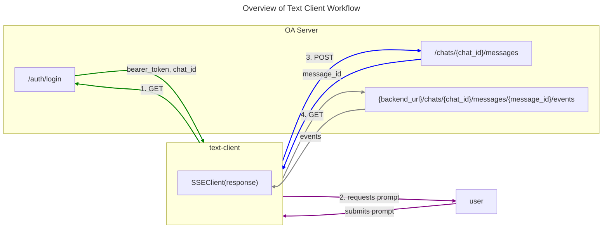

# Inference

### From the perspective of the Text Client



For development, a basic REPL client is used as a chat interface, built around [Typer](https://typer.tiangolo.com/). The bulk of the logic is in `inference.text-client.text_client_utils.DebugClient`. The basic steps are as follows:

1. After authenticating with the backend open assistant server, the `DebugClient` creates a "chat" by posting to `/chats`, which returns a chat id for session.

2. The script then collects the user prompt. 

3. The `DebugClient` posts to the endpoint `/chats/{chat_id}/messages`. Included in this request is the message content, a `parent_id:str` (ID of assistant's response to prior message, if there is one), the `model_config_name:str`, and inference `sampling_parameters:dict`. In the response, the server will return a `message_id:str`. 

4. The client will use this id to make a GET request to `{backend_url}/chats/{chat_id}/messages/{message_id}/events`.
Critically, in this `get()` method of requests, the `stream=True` is passed, meaning that the response content will not be immediately downloaded but rather streamed. Additionally, the actual GET request must have `"Accept": "text/event-stream"` in the headers to let 
the server know we are awaiting an event stream.

5. The response is then used to instantiate an SSEClient, which - via its events() method,
returns an iterable that can be used to print out inference results, one token at a time.

6. After exhausting the events iterable (ie inference is complete), the user is prompted for a new message.


### From the perspective of the OA Inference Server

The inference server is built around [FastAPI](https://fastapi.tiangolo.com/).

1. When the client posts to `/chats`, the UserChatRepository - an interface between application logic and chats message
tables - creates a chat in the chat table, which assigns the needed chat id and is returned in the response to the client.

2. Next, the client posts to `/chats/{chat_id}/messages`, which uses the UserChatRepository to:
    1. If chat table contains no title for chat of that id, updates the chat table with the initial user prompt as title.
    2. Creates a message in the message table for the user.
    3. Create a message in the message table with `state=inference.MessageState.pending` for the assistant's response.
    4. Add the id of the pending assistant's message to a redis queue.
    5. Return a `CreateMessageResponse` object (a Pydantic model), with the prompter message field and (pending) assistant message field. The client will get an assistant message id from this.

3. Once the client has the assistant message id, it will make a GET request to `/chats/{chat_id}/messages/{message_id}/events`. Upon receiving this request, the server retrieves the message from the message table and verifies that the message isn't finished and that the message role is assistant. 

After this, we create a Redis queue for this specific message id. From here, we poll the queue, using the `dequeue()` method. By default this method will block for up to 1 second, however if a message is added to the queue in that interval, it will automatically be returned. Otherwise, `dequeue()` will return `None`.

If `None` is returned and this is the first time we have pulled the queue since its creation, we will yield a `chat_schema.PendingResponseEvent`. The loop will continue, with 1 second blocking (by default), until a message item is returned. A message item is a tuple where the first element is a string of the message id, and the second element is a response.

The EventSourceResponse is Server Sent Events (SSE) plugin for Starlette/FastAPI, which takes content
and returns it as part of a HTTP event stream. You can check out the EventSourceResposethe library's [source code](https://github.com/sysid/sse-starlette/tree/master) for more details about how this works.

### From the perspective of the OA Worker

After loading the tokenizer, a worker establishes a websocket connection with the server and sends its worker config to the server (at `/workers/work`).

1. we get a work request, which is parsed by oasst_shared.inference.WorkParameters
2. we then recreate these as stream parameters, using `inference.worker.interface.GenerateStreamParameters.from_work_parameters()`. ANSWER -> WHY DO WE NEED TO RECREATE PARAMS AS THIS SECOND CLASS?
3. what is work_request.thread.messages

A few key metadata structures come into play at this point.

A message is parsed into a `WorkRequest`.
```
class WorkRequest(pydantic.BaseModel):
    thread: Thread = pydantic.Field(..., repr=False)
    created_at: datetime.datetime = pydantic.Field(default_factory=datetime.datetime.utcnow)
    parameters: WorkParameters = pydantic.Field(default_factory=WorkParameters)
```

Within a `WorkRequest`, a `Thread`-type attribute contains the conversation history.
```
class Thread(pydantic.BaseModel):
    messages: list[MessageRead]
```
Within `Thread`, the `messages` attribute is a list of `MessageRead` objects (better to call them dictionaries? alternate phrases?).
```
class MessageRead(pydantic.BaseModel):
    id: str
    content: str | None
    role: Literal["prompter", "assistant"]
    state: MessageState
    score: int
    reports: list[Report] = []

    @property
    def is_assistant(self) -> bool:
        return self.role == "assistant"
```
After the work request, its thread attribute, and all of the `MessageRead` objects,
All messages are concatenated together. The concatenation starts with a global message prefix,
the main prompt, which is defined in `inference/worker/settings.py` as the `Settings` class.

The design of setting prompts should probably come from a separate application configuration so it can be updated without deploying new code. It might make sense to think through a new design for these workers.

What do we need from a better prompts system? what stakeholders should this system serve? What interface 
does each of these stakeholders need?

- safety team
- product team
- api user?

Does each component need a way to version control itself, along with the collective prompt itself?

Do we need the capability to have different promopts for different users simultaneously? Does everyone see
same prompt?


note: both `inference/worker/interface.py` and `oasst-shared/oasst_shared/schemas/inference.py` have pydantic classes.


why are we using websockets instead of a regular message queue? Do we need to-way communication?

in inference.worker.interface.GenerateStreamParameters.from_work_parameters(), why is this not a class method?

