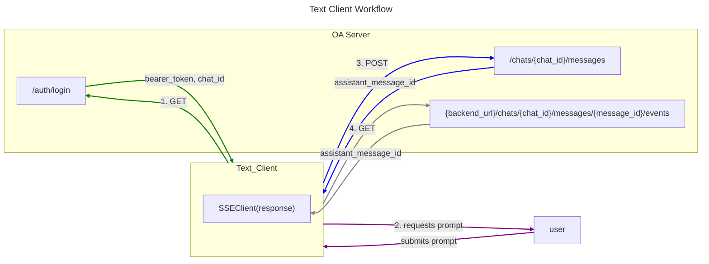

# Inference

### From the perspective of the Text Client

For development, a basic REPL client is used as a chat interface, built around [Typer](https://typer.tiangolo.com/). The bulk of the logic is in `inference.text-clinet.text_client_utils.DebugClient`. The basic steps are as follows:

1. After authenticating with the backend open assistant server, the client creates a "chat" by posting to `/chats`, which returns a chat id for session.

2. The client then collects the user prompt. 

3. The client posts to the endpoint `/chats/{chat_id}/messages`. Included in this request is the message content and a parent_id (assistant's response to prior message, if there is one). In the response, the server will return an assistant_message id. 

4. The client will use this id to make a GET request to `{backend_url}/chats/{chat_id}/messages/{message_id}/events`.
Critically, in this `get()` method of requests, the `stream=True` is passed, meaning that the response content will not be immediately downloaded but rather streamed. Additionally, the actual GET request must have `"Accept": "text/event-stream"` in the headers to let 
the server know we are awaiting an event stream.

5. The response is then used to instantiate an SSEClient, which - via its events() method,
returns an iterable that can be used to print out inference results, one token at a time.

6. After exhausting the events iterable (ie inference is complete), the user is prompted for a new message.

### From the perspective of the OA Inference Server

The inference server is built around [FastAPI](https://fastapi.tiangolo.com/).

1. When the client posts to `/chats`, the UserChatRepository - an interface between application logic and chats message
tables - creates a chat in the chat table, which assigns the needed chat id and is returned in the response to the client.

2. Next, the client posts to `/chats/{chat_id}/messages`, which uses the UserChatRepository to:
    1. If chat table contains no title for chat of that id, updates the chat table with the initial user prompt as title.
    2. Creates a message in the message table for the user.
    3. Create a message in the message table with `state=inference.MessageState.pending` for the assistant's response.
    4. Add the id of the pending assistant's message to a redis queue.
    5. Return a `CreateMessageResponse` object (a Pydantic model), with the prompter message field and (pending) assistant message field. The client will get an assistant message id from this.

3. 