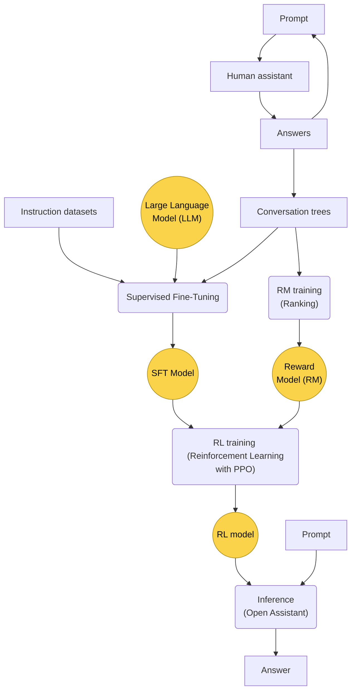
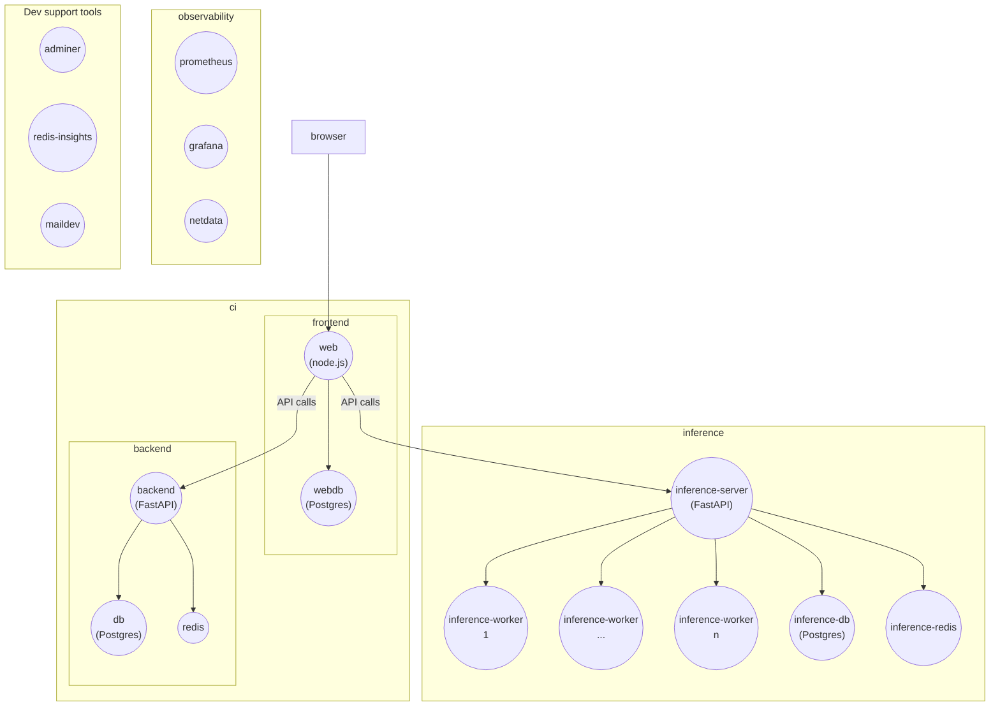

# Introduction to Open Assistant for developers

This is a guide to understand the goals, tools, technologies and teams behind
[Open Assistant](https://open-assistant.io/), a project that tries to be the
community-driven open source alternative to ChatGPT. It is intended for
developers that want to contribute to the project. See the
[contributing guide](https://github.com/LAION-AI/Open-Assistant/blob/main/CONTRIBUTING.md)
for detailed instructions on how to contribute.

## Overview of the Open Assistant project

The main goal of the project is to have a chatbot that can answer questions,
adapting a **Large Language Model (LLM)** to better follow instructions. For
this, the project uses the approach proposed by the
[InstructGPT paper](https://arxiv.org/abs/2203.02155), which is based on
**Reinforcement Learning with Human Feedback (RLHF)**. InstructGPT's proposal
basically consists in three steps (see the figure below):

1. **Collect demonstration data and train a supervised policy.** The idea is
   having a lot of examples of conversations between an assistant and a human
   that gives instructions, so that they can be used as examples to train an
   existing LLM with supervised learning, what is called Supervised Fine-Tuning
   (SFT). Thus, this training is called **"SFT training"** and we will call the
   resulting model the **"SFT model"**.

   These sample conversations are generated by humans acting as prompters and
   also humans acting as assistants. It's important to note that a prompt can be
   answered by different humans, so that there are different examples of how an
   assistant could respond to a given prompt, which will be fundamental for the
   next step. From an initial prompt, an assistant answer is created, and then
   new prompts to this answer are created, and so on. This generates
   "conversation trees".

   The LLM can also be further fine-tuned using **"instruction datasets"**,
   which are a set of examples of conversations in the form of instruction and
   response obtained from websites like StackOverflow or Reddit.

2. **Collect comparison data and train a reward model.** Here, conversations are
   sampled from the conversations obtained in the previous step, and a human
   **ranks** the different assistant answers for each prompt that were created
   by different humans in the previous step. This data is used to train a
   **reward model (RM)** that favors good answers, and the corresponding task is
   called **"RM training"**.

   In the future, this ranking step could be done not only for human generated
   answers from step 1, but also to samples generated by the SFT model.

3. **Optimize a policy against the reward model using reinforcement learning
   (RL).** A proximal policy optimization (PPO) algorithm is used to generate a
   new model from the fine-tuned model. To optimize this PPO, the reward model
   obtained in the previous step is used with the SFT model, so the generated
   **RL model** is better at following instructions. This task is called **"RL
   training"**.

With all this we have a RL model that can be used to create an assistant. The
process of answering prompts with this RL model is called **"the inference"**.

The whole Open Assistant approach is summarized in this figure:

One of the goals of the project is being able to run this RL model in consumer
hardware: current models require very powerful GPUs that are out of reach for
normal users. The project aims high: after a basic assistant is obtained, the
project wants to do more and to be able to connect it to external tools. This is
a research field called
[Augmented Language Models](https://arxiv.org/abs/2302.07842). In addition, it
wants to give the users the ability to fine-tune their own models, so that they
can create their own custom assistants.

## The tools

A web application, usually referred to as **"the web frontend"**, has been
created. Initially, it supports the first two steps of the process outlined in
the previous section, which require humans creating conversations (step 1) and
ranking answers (step 2).

For this same goal, data gathering, a discord bot is being created. We'll call
it **"the data gathering discord bot"**.

For doing the inference, once the final model is ready, an **"inference
service"** is being created. Another section will be added to the web frontend,
so that the assistant can be used from the web.

In addition, for collecting the instruction dataset, a set of **scripts and
notebooks** is being developed.

There's also a **FastAPI backend** that stores the conversation trees and its
metadata (labels and ranking).

## The technologies

### The web frontend

The web frontend is a [Next.js](https://nextjs.org/) application, so it uses
Typescript, HTML, CSS and node.js. Some libraries it uses are
[Chakra UI](https://chakra-ui.com/) for the UI elements and
[i18-next](https://www.i18next.com/) for the internationalization. Its source
code is in the
[website directory](https://github.com/LAION-AI/Open-Assistant/tree/main/website).
The
[README in that directory](https://github.com/LAION-AI/Open-Assistant/blob/main/website/README.md)
has more information about the frontend.

The container in the
[dockerfile](https://github.com/LAION-AI/Open-Assistant/blob/main/docker-compose.yaml)
is called `web` with a comment that refers to it as the "oassist web service".
The node.js server is "the backend of the frontend", not to be confused with the
"FastAPI backend" that will be discussed later.

The web frontend also uses a Postgres database for authentication and caching.
This is called the `webdb` in the Dockerfile. [Prisma](https://www.prisma.io/)
is used as an ORM for this Postgres database.

When you run `npm run dev` in the website directory, it starts the Next.js
application in the node server. The Next.js application is available at
`http://localhost:3000`.

In the Dockerfile, there's also a `maildev` container that is used during to be
able to sent emails for registration, although for local development there are
fake users pre-created and this is not required. There is a fake user called
`dev` and it can be assigned a role during log in.

There are other scripts related to the frontend in the directory
[scripts/frontend-development](https://github.com/LAION-AI/Open-Assistant/tree/main/scripts/frontend-development).

Another included tool that can be interesting during development is
[storybook](https://storybook.js.org/): it allows you to test UI components
without having to run the whole application.

### The data gathering Discord bot

This is a Discord bot that is used to gather data for the assistant, as a
complement to the web data gathering application. Its source code is in the
[discord-bot](https://github.com/LAION-AI/Open-Assistant/tree/main/discord-bot)
directory and it's written in Python.

### The FastAPI backend

This provides an API that's used by the web frontend and the Discord bot to
store conversation trees and their metadata. It's written in Python using
FastAPI as framework and its source code is in the
[backend directory](https://github.com/LAION-AI/Open-Assistant/tree/main/backend).
It's called `backend` in the Dockerfile.

It has another Postgres database, the "backend database", called just `db` in
the Dockerfile.

There's also a Redis database, called `redis` in the Dockerfile, for caching API
requets.

In the Dockerfile, there are also two containers with development support tools
for the databases: `adminer`, that can be used to inspect the Postgres
databases, and `redis-insights` to inspect the Redis database.

Although there's some data already in the Postgres backend database, more can be
generated using the automation script called
[auto_main.py](https://github.com/LAION-AI/Open-Assistant/blob/main/text-frontend/auto_main.py).

There's
[a presentation](https://docs.google.com/presentation/d/1iaX_nxasVWlvPiSNs0cllR9L_1neZq0RJxd6MFEalUY/edit#slide=id.g1c26e0a54b8_0_948)
that explains the main data structures used in the backend, basically, the
conversation tree and the work package.

### The inference service

The inference service will be the component that answers prompts when the model
is ready, i.e., the assistant. It's written in Python and its source code is in
the [inference](https://github.com/LAION-AI/Open-Assistant/tree/main/inference)
directory. It has a server and several workers. It also has its own Postgres
database in a container called `inference-db` in the Dockerfile, and a Redis
database in the `redis-inference` container.

The server is a FastAPI application that communicates via websockets with the
workers, which are the ones that use the model to carry out the inference.

### Model training tools

The tools to train the different models are in the
[model](https://github.com/LAION-AI/Open-Assistant/tree/main/model) directory.
They are scripts written in Python that use libraries such as PyTorch and
Transformers from Hugging Face.

### The instruction dataset scripts and notebooks

The collection of the instruction datasets is organized in the
[data](https://github.com/LAION-AI/Open-Assistant/tree/main/data) directory.
[This guide](https://github.com/LAION-AI/Open-Assistant/blob/main/data/datasets/README.md)
explains how to contribute a new dataset.

There's also a
[notebooks](https://github.com/LAION-AI/Open-Assistant/tree/main/notebooks)
directory with different noteboooks to process the data.

### The docs

The documentation is in the
[docs](https://github.com/LAION-AI/Open-Assistant/tree/main/docs) directory.
It's written in Markdown and it uses Docosaurus 2 as the static site generator.

### The deployment

The deployment is done with containers, using V2 of `docker compose` (not to be
confused with `docker-compose`, with hyphen, see this
[FAQ](https://projects.laion.ai/Open-Assistant/docs/faq#docker-compose-instead-of-docker-compose)).
It is based on profiles. These are the ones that are currently available:

- `frontend-dev`. It includes these containers:

  - `db`, `redis`, `webdb`, `adminer`, `maildev`, `backend`

Notice that it doesn't include the oassist web service (`web` container): during
frontend development, you are supposed to launch it with `npm run dev` in the
website directory.

- `backend-dev`. It includes these containers:

  - `db`, `redis`, `redis-insights`, `adminer`, `backend`

- `ci`. It's basically both the backend and the frontend without the development
  tools. It includes these containers:

  - `db`, `redis`, `webdb`, `maildev`, `backend`, `web`

- `inference`. It includes these containers:

  - `inference-db`, `inference-server`, `inference-worker`, `inference-redis`

- `observability`. It includes tools to monitor the application. It includes
  these containers:
  - `prometheus`, `grafana`, `netdata`

Notice that you can combine profiles, for example, `ci` and `observability`.

The following figure shows containers in circles, grouped in boxes that
correspond with roles, not with actual profiles:

There are ansible playbooks in the
[ansible](https://github.com/LAION-AI/Open-Assistant/tree/main/ansible)
directory.

In addition to the production deployment, available at the project website,
<https://open-assistant.io/es>, there's also a staging deployment at
<https://web.staging.open-assistant.io/>.

## The teams

The major contributors, founders and initiators are Yannic Kilcher
([yk](https://github.com/yk) on GitHub), who has a
[YouTube channel](https://www.youtube.com/@YannicKilcher) with a large
community, [Andreas Köpf](https://github.com/andreaskoepf), who is the Tech
Lead, [Christoph Schumann](https://github.com/christophschuhmann), who is the
Organizational Lead and a founder of [LAION](https://laion.ai/), and Huu Nguyen,
from [Ontocord](https://github.com/ontocord).

There's a
[CODEOWNERS](https://github.com/LAION-AI/Open-Assistant/blob/main/CODEOWNERS)
file that lists the code owners of different parts of the project. However,
there are many
[other contributors](https://github.com/LAION-AI/Open-Assistant/graphs/contributors),
organized in teams, which use
[the Discord server](https://ykilcher.com/open-assistant-discord) for
coordination.
