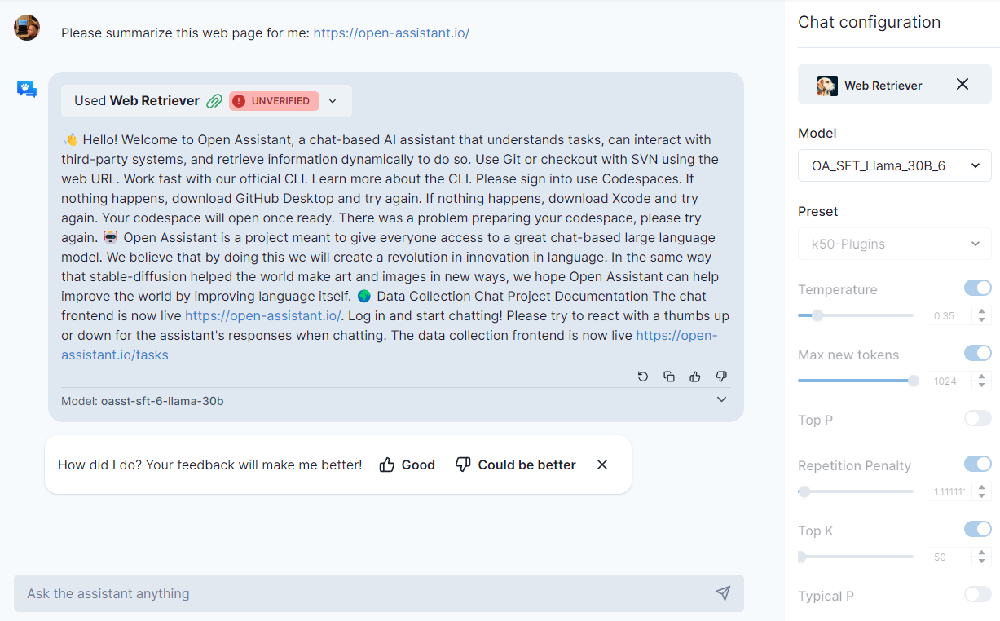
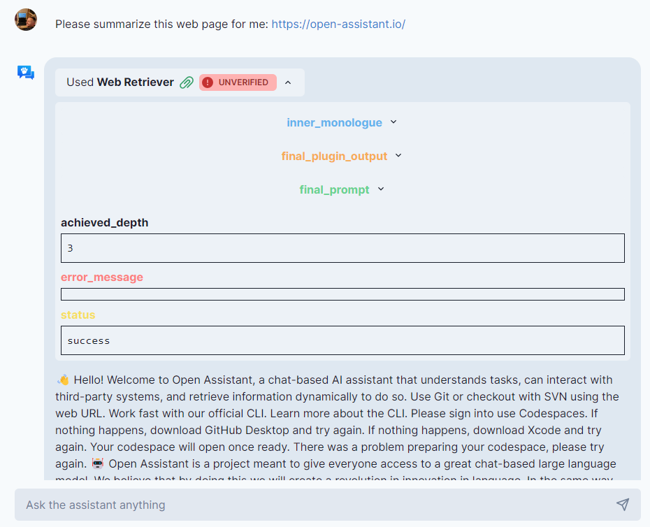

# Getting Started

## Quick Start

Use the "Web Retriever" plugin by adding this url:
https://web-retriever-draganjovanovich.vercel.app/ai-plugin.json

You should then be able to use it like this:

## Inspect Results

Once you get results back from a plugin you can explore the various internal
steps the plugin took to get the results.

